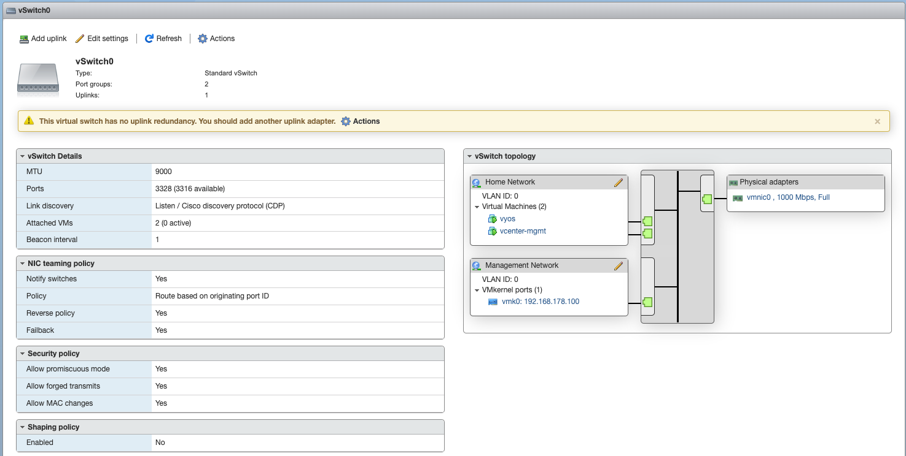
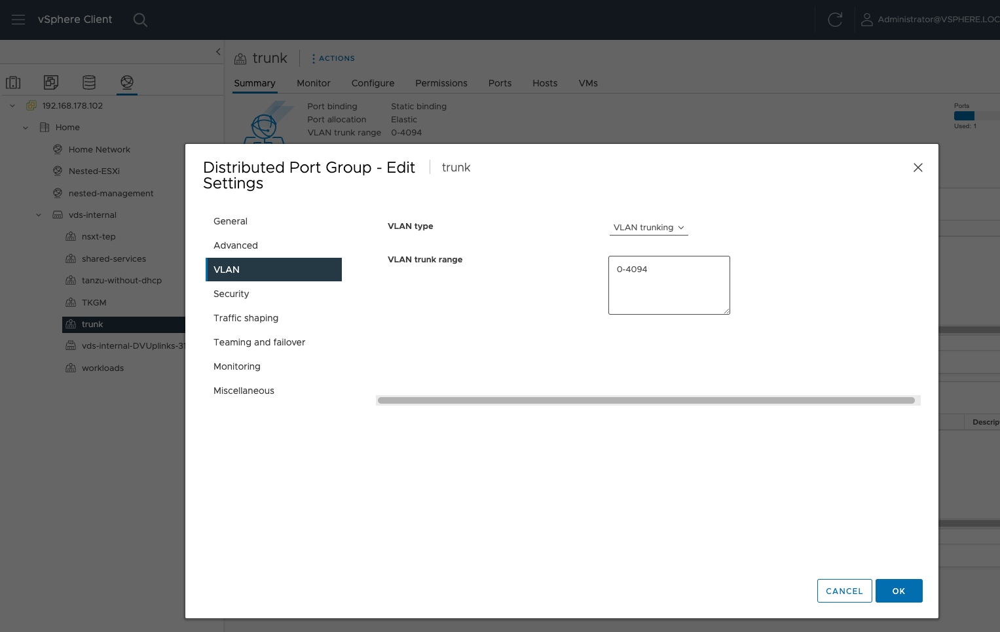
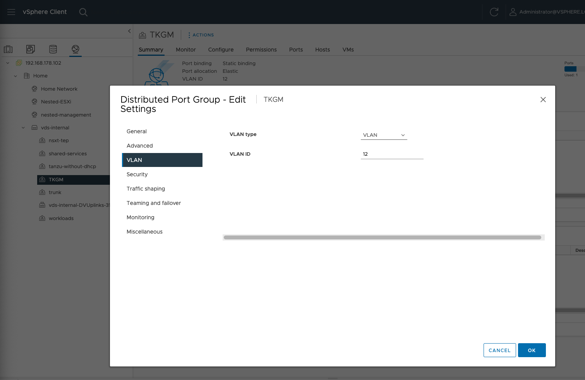

# Homelab

When I joined VMware in February 2021 I have built a homelab to be able to quickly spin up test environments using VMware products with a primary focus on Tanzu Labs product portfolio.

## BOM

| Component   | Item                                                                               |
|-------------|------------------------------------------------------------------------------------|
| CPU         | HP/AMD EPYC 7551 PS7551BDVIHAF 2GHz 64MB 32 Core Processor                         |
| Motherboard | Supermicro H11SSL-i Socket SP3 ATX                                                 |
| RAM         | Samsung 4x 64GB 256GB DDR4 ECC RAM 2933 Mhz RDIMM                                  |
| SSD         | Crucial MX500 2TB                                                                  |
| NVMe        | Samsung MZ-V7S2T0BW SSD 970 EVO Plus 2 TB M.2 Internal NVMe SSD (up to 3.500 MB/s) |
| Cooler      | Noctua NH U12s TR4 SP3                                                             |
| GPU         | Asus GeForce GT 710 1GB                                                            |
| Case        | Fractal Design Core 2500                                                           |
| PSU         | Kolink Enclave 500W                                                                |

## Setup

There is a "Management vCenter" (`vcenter-mgmt`) VM deployed on the physical host that manages the physical host.
As a result, the Management vCenter looks like this:


Here you can see:

- `192.168.178.100`: the physical ESXi host
- `jumpbox01`: an Ubuntu jumpbox for testing purposes
- VMs prefixed with `tkgs-`: a nested lab environment (more details see [Nested Lab Setup](#nested-lab-setup))
- `vcenter-mgmt`: Management vCenter
- `vrli`: vRealize Log Insight
- `vrops`: vRealize Operations Manager
- `vyos`: the VyOS Router, responsible for the entire homelab network
- `windows`: a Windows VM

### Networking & Routing

The physical ESXi host has a virtual Switch `vSwitch0` with 2 port groups `Management Network` (the default port group) and `Home Network`:



Apart from the physical host there is only `vyos` running in the same network. The VyOS router acts as the entry point and default gateway to the homelab. My home router has a static IP route configured to forward requests to my internal homelab IP ranges `172.20.0.0/16` and `172.30.0.0/16` to the VyOS router.

The VyOS router has another NIC in a trunk port group deployed on a virtual distributed switch (`vds-internal`) via the management vCenter:



Looking into the vyos configuration we thus have two network interfaces - `eth0` is the `Home Network` and `eth1` is the trunk port group:

```sh
vyos@vyos# show interfaces
 ethernet eth0 {
     address 192.168.178.101/24
     hw-id 00:0c:29:85:a5:3b
     offload {
         gro
         gso
         sg
         tso
     }
 }
 ethernet eth1 {
     hw-id 00:0c:29:85:a5:45
     mtu 9000
 }
 loopback lo {
 }
```

Refer to the [VyOS Quick Start guide](https://docs.vyos.io/en/latest/quick-start.html) for more information how to configure interfaces, protocols, firewalls and more.

#### Enable Mac Learning

Read [Native MAC Learning in vSphere 6.7 removes the need for Promiscuous mode for Nested ESXi](https://williamlam.com/2018/04/native-mac-learning-in-vsphere-6-7-removes-the-need-for-promiscuous-mode-for-nested-esxi.html) - I am not the best person to explain this :wink:.

TL;DR: It's best to enable mac learning on all port groups deployed on the vDS `vds-internal` used for nested labs.

Steps:

1. Install Powershell
1. open it in a terminal emulator: `pwsh`
1. Install PowerCLI:

    ```powershell
    Install-Module VMware.PowerCLI -Scope CurrentUser
    ```

1. If using self-signed certificates on vCenter ignore verifying the SSL certificate:

    ```powershell
    Set-PowerCLIConfiguration -InvalidCertificateAction Ignore -Confirm:$false
    ```

1. Connect to vCenter:

    ```powershell
    Connect-VIServer -Server 192.168.178.102 -Protocol https -User administrator@vsphere.local -Password VMware1!
    ```

1. download the powershell functions `Get-MacLearn` and `Set-MacLearn` from [here](https://github.com/lamw/vmware-scripts/blob/master/powershell/MacLearn.ps1)
1. Set Mac learning on a port group:

    ```powershell
    Set-MacLearn -DVPortgroupName @("Nested-01-DVPG") -EnableMacLearn $true -EnablePromiscuous $false -EnableForgedTransmit $true -EnableMacChange $false
    ```

1. Get Mac learning details:

    ```powershell
    Get-MacLearn -DVPortgroupName @("Nested-01-DVPG")
    ```

#### Create a network for a nested lab environment

In order to create different networks for different nested lab environments I have to:

1. create distributed port group on the vDS `vds-internal` with a specific VLAN ID
1. create an interface with the same VLAN ID number as `vif` on `eth1` in VyOS

##### Nested Lab network example

We create a distributed port group called `TKGM` with VLAN ID `12`:



As a consequence we create a virtual interface in VyOS with ID `12` and an IP range of my choice:

```shell
set interfaces ethernet eth1 vif 12 address 172.20.12.1/22
set interfaces ethernet eth1 vif 12 description TKGM
set interfaces ethernet eth1 vif 12 mtu 9000
commit 
save
```

The result is:

```sh
vyos@vyos# show interfaces
 ethernet eth0 {
     address 192.168.178.101/24
     hw-id 00:0c:29:85:a5:3b
     offload {
         gro
         gso
         sg
         tso
     }
 }
 ethernet eth1 {
     hw-id 00:0c:29:85:a5:45
     mtu 9000
     vif 12 {
         address 172.20.12.1/22
         description TKGM
         mtu 9000
     }
 }
 loopback lo {
 }
```

We can then specify this port group in the nested lab setup config file - see [details below](#nested-lab-setup).

#### Use a NSX segment and make it routable

Some of my nested labs include [NSX](https://docs.vmware.com/en/VMware-NSX/index.html) software-defined network as overlay networks for products such as [vSphere IaaS Control Plane](https://docs.vmware.com/en/VMware-vSphere/8.0/vsphere-with-tanzu-installation-configuration/GUID-7EE247EB-4736-4BC8-A6B0-0123B6ECC812.html), [Tanzu Application Service (TAS) for VMs](https://docs.vmware.com/en/VMware-Tanzu-Application-Service/5.0/tas-for-vms/vsphere-nsx-t.html) or [Tanzu Kubernetes Grid Integrated Edition (TKGI)](https://docs.vmware.com/en/VMware-Tanzu-Kubernetes-Grid-Integrated-Edition/1.20/tkgi/GUID-nsxt-topologies.html).

When creating a [NSX Segment](https://docs.vmware.com/en/VMware-NSX-T-Data-Center/3.2/administration/GUID-316E5027-E588-455C-88AD-A7DA930A4F0B.html) I have to create a static route of the segment's CIDR with the NSX Tier-0 IP address being the next-hop. Assuming you want to use the cidr `172.30.2.0/24` for a NSX segment, and the Tier0's IP address is `172.20.17.13`, then you create a static route in VyOS with

```shell
set protocols static route 172.30.2.0/24 next-hop 172.20.17.13
```

!!! info
    When building your nested labs with [vmware-lab-builder](https://github.com/laidbackware/vmware-lab-builder) and the [opinionated var-examples](https://github.com/laidbackware/vmware-lab-builder/tree/main/var-examples) the T0's IP address is the 3rd IP after the `starting_addr`. So in [this TKGS+NSX-T example](https://github.com/laidbackware/vmware-lab-builder/blob/main/var-examples/tanzu/vsphere-nsxt/opinionated-1host.yml) with `starting_addr: "192.168.0.160"` the T0's IP address will be `192.168.0.163`.

### Nested Lab Setup

To bootstrap nested lab environments I am using [vmware-lab-builder](https://github.com/laidbackware/vmware-lab-builder), Kudos to Matt :clap:.

An example config I am using to deploy a TKGm environment is

```yaml
---
# SOFTWARE_DIR must contain all required software
vc_iso: "{{ lookup('env', 'SOFTWARE_DIR') }}/VMware-VCSA-all-7.0.3-19234570.iso"
esxi_ova: "{{ lookup('env', 'SOFTWARE_DIR') }}/Nested_ESXi7.0u3c_Appliance_Template_v1.ova"
nsx_alb_controller_ova: "{{ lookup('env', 'SOFTWARE_DIR') }}/controller-20.1.6-9132.ova"
tkgm_os_kubernetes_ova: "{{ lookup('env', 'SOFTWARE_DIR') }}/photon-3-kube-v1.25.7+vmware.2-tkg.1-8795debf8031d8e671660af83b673daa.ova"

environment_tag: "tanzu-multi-cloud-avi"  # Used to prepend object names in hosting vCenter
dns_server: "192.168.178.1"
dns_domain: "home.local"
ntp_server_ip: "192.168.178.1"
disk_mode: thin  # How all disks should be deployed
# This will be set everywhere!
nested_host_password: "{{ opinionated.master_password }}"

hosting_vcenter:  # This is the vCenter which will be the target for nested vCenters and ESXi hosts
  ip: "192.168.178.102"
  username: "{{ lookup('env', 'PARENT_VCENTER_USERNAME') }}"
  password: "{{ lookup('env', 'PARENT_VCENTER_PASSWORD') }}"
  datacenter: "Home"  # Target for all VM deployment

# This section is only referenced by other variables in this file
opinionated:
  master_password: "VMware1!"
  number_of_hosts: 1  # number of ESXi VMs to deploy
  nested_hosts:
    cpu_cores: 12  # CPU count per nested host
    ram_in_gb: 96  # memory per nested host
    local_disks:  # (optional) this section can be removed to not modify local disks
      - size_gb: 500
        datastore_prefix: "datastore"  # omit this to not have a datastore created
  hosting_cluster: Physical
  hosting_datastore: NVME
  hosting_network:
    base:
      port_group: TKGM
      cidr: "172.20.12.0/22"
      gateway: "172.20.12.1"
      # A TKGM deployment requires 5 contiguous IPs. vCenter, Avi Controller, Esxi, 2 x Avi Service Engines.
      starting_addr: "172.20.12.10"
    # If using your own network you must provide at least a /24.
    # In the example below the same subnet is used for both the workload nodes and the VIPs
    # Avi will use the IP range defined vip_ip_range for VIPs
    # TKG needs DHCP to be configured for the first half of the subnet
    workload:
      port_group: trunk
      vlan_id: 24
      cidr: "172.20.24.0/24"
      gateway: "172.20.24.1"
      vip_ip_range: "172.20.24.128-172.20.24.254"
  avi_control_plane_ha_provider: true
  # This public key will be assigned to the created VMs, so you must have the private key to be able to use SSH
  ssh_public_key: ssh-rsa AAAAB3NzaC1yc2EAAAADAQABAAACAQDNre3RSDIQIbswU/AbFMrdGDTRNIxXs1L1aY9ozDm/TsTKBf85Kr/0Bi3Az1DgOifR3s7SblZFhqKtGueqyv4NKoNy8dgxUsFzGKaRBmwGfCn9rp0hAV/r6BdyhRGloltaZ4KuR3v3AQTTjpyWPsf55wUIMYtOtrQ1tnNspmZmEyh11e8Hbwsq6jaVDCpSWkLPgir4lDTFANRpA/MaU9XUG3PjYszaNFgIScUwQVl0otmCpFgZgf9jXwy4K5CpG4u/1CSIA6H+5XAJaAzDNGcAIGQKaIAj6Cvd8QyUs+UEV5n6rJSsp+gnfu0gEYx4QmeWwcVdGu1Re18qHVgAP56gF58uV7p/V60Tlf9IFqkz67lwLlOuq9dfNmPGIJ/lydcLgcvXmJObyntm1jFi5ChtIrBd7uShh9b6wwOLhekv3TwOn0nHPjXDabVDcmfXVhAgyJyknCFv1Hm3UFwTngoc4WFm38wgxzajOzxt83b8bXXhMNaU8L8VXtVpfIrDHbAKhho6Aaf8JahKa46UxFa4yjkVfN75N4++8CdCpGiruLUp1rW4zYkrjxBuIBcib/06QTsvdPIsYVsPic/mYoxBVTclvLi/ELVdwFFSavwNKI+XwH6ENI7vckkVs6HpM0GJu4qsvmhrlkGVmNM0BkaJN1i1CQgn01OTz+um1rjr+Q== andy.knapp.ak@gmail.com

#####################################################################
### No need to edit below this line for an opinionated deployment ###
#####################################################################

nested_vcenter:  # the vCenter appliance that will be deployed
  ip: "{{ opinionated.hosting_network.base.starting_addr }}"  # vCenter ip address
  mask: "{{ opinionated.hosting_network.base.cidr.split('/')[1] }}"
  gw: "{{ opinionated.hosting_network.base.gateway }}"
  host_name: "{{ opinionated.hosting_network.base.starting_addr }}"  # FQDN if there is working DNS server, otherwise put the ip as a name
  username: "administrator@vsphere.local"
  password: "{{ opinionated.master_password }}"
  datacenter: "Lab"  # DC to create after deployment
  # Below are properties of parent cluster
  hosting_network: "{{ opinionated.hosting_network.base.port_group }}"  # Parent port group where the vCenter VM will be deployed
  hosting_cluster: "{{ opinionated.hosting_cluster }}"  # Parent cluster where the vCenter VM will be deployed
  hosting_datastore: "{{ opinionated.hosting_datastore }}"  # Parent datastore where the vCenter VM will be deployed

nested_clusters:  # You can add clusters in this section by duplicating the existing cluster
  compute:  # This will be the name of the cluster in the nested  vCenter. Below are the minimum settings.
    enable_drs: true
    # HA can only be enabled if there is are datastores accessible by all hosts.
    enable_ha: true
    ha_host_monitoring: disabled
    # Below are properties of the hosting cluster
    hosting_cluster: "{{ opinionated.hosting_cluster }}"  # The nested ESXi VMs will be deployed here
    hosting_datastore: "{{ opinionated.hosting_datastore }}"  # Datastore target for nested ESXi VMs
    # Settings below are assigned to each host in the cluster
    vswitch0_vm_port_group_name: vm-network
    vswitch0_vm_port_group_vlan: "0"
    cpu_cores: "{{ opinionated.nested_hosts.cpu_cores }}"  # CPU count
    ram_in_gb: "{{ opinionated.nested_hosts.ram_in_gb }}"  # memory
    # In order list of disks to assign to the nested host. All will be marked as SSD.
    # Datastore names will be automatically be pre-pended with the hostname. E.g esx1
    # If the datastore_prefix property is removed the disk will not be set as a datastore
    # To leave the default OVA disks in place, delete this section.
    nested_hosts_disks: "{{ opinionated.nested_hosts.local_disks | default(omit) }}"
    # Added in vmnic order, these port groups must exist on the physical host
    # Must specify at least 2 port groups, up to a maximum of 10
    vmnic_physical_portgroup_assignment:
      - name: "{{ opinionated.hosting_network.base.port_group }}"
      - name: "{{ opinionated.hosting_network.workload.port_group }}"
    resource_pools:  # List of resource pools, remove if not needed
      - tkc

# Below specifies how many IPs are reserved for other functions
opinionated_host_ip_ofset: 4
# You can add nested ESXi hosts below
nested_hosts: >-
  [
    
    {
      "name": "esx{{ host_number + 1 }}",
      "ip": "{{ opinionated.hosting_network.base.starting_addr | ipmath(opinionated_host_ip_ofset + host_number) }}",
      "mask": "{{ opinionated.hosting_network.base.cidr | ansible.netcommon.ipaddr('netmask') }}",
      "gw": "{{ opinionated.hosting_network.base.gateway }}",
      "nested_cluster": "compute"
    },
    
  ]

distributed_switches:  # To not create any distributed switches, comment this section.
  - vds_name: vds
    mtu: 1500
    vds_version: 7.0.0
    clusters:  # distributed switch will be attached to all hosts in the clusters defined
      - compute
    uplink_quantity: 1
    vmnics:
      - vmnic1
    distributed_port_groups:
      - port_group_name: workload-pg
        vlan_id: "{{ opinionated.hosting_network.workload.vlan_id |default(0) }}"

vm_templates:
  - local_path: "{{ tkgm_os_kubernetes_ova }}"
    vcenter_server: "{{ nested_vcenter.ip }}"
    vcenter_username: "{{ nested_vcenter.username }}"
    vcenter_password: "{{ nested_vcenter.password }}"
    vcenter_datacenter: "{{ nested_vcenter.datacenter }}"
    vcenter_datastore: datastore-esx1
    vcenter_network: workload-pg
    vsphere_clusters: "{{ nested_clusters.keys() | list }}"

tanzu_multi_cloud:
  generated_config_file_name: cluster-config.yml

  avi_cloud_name: "{{ nsx_alb.cloud_name | default('Default-Cloud') }}"
  avi_controller: "{{ nsx_alb.controller_ip }}"
  avi_data_network: "{{ nsx_alb.se_vip_port_group }}"
  avi_data_network_cidr: "{{ nsx_alb.se_vip_network_cidr }}"
  avi_password: "{{ nsx_alb.controller_password }}"
  avi_service_engine_group: "{{ nsx_alb.se_group_name | default('Default-Group') }}"
  avi_username: "{{ nsx_alb.controller_username }}"
  avi_control_plane_ha_provider: "{{ opinionated.avi_control_plane_ha_provider }}"

  # used in TKGM cluster config yaml
  vsphere_control_plane_endpoint: "{{ opinionated.hosting_network.workload.cidr | ipmath(2) }}"
  vsphere_datacenter_path: "/{{ nested_vcenter.datacenter }}"
  vsphere_datastore_path: "/{{ nested_vcenter.datacenter }}/datastore/datastore-esx1"
  vsphere_folder_path: "/{{ nested_vcenter.datacenter }}/vm"
  vsphere_network: workload-pg
  vsphere_password: "{{ nested_vcenter.password }}"
  vsphere_resource_pool_path: "/{{ nested_vcenter.datacenter }}/host/compute/Resources"
  vsphere_server: "{{ nested_vcenter.ip }}"
  vsphere_ssh_authorized_key: "{{ opinionated.ssh_public_key }}"
  vsphere_username: "{{ nested_vcenter.username }}"

nsx_alb:
  api_version: "20.1.6"
  controller_username: admin
  controller_password: "{{ opinionated.master_password }}"
  controller_ssh_public_key: "{{ opinionated.ssh_public_key }}"
  controller_default_password: "{{ lookup('env', 'AVI_DEFAULT_PASSWORD') }}"

  controller_ip: "{{ opinionated.hosting_network.base.starting_addr | ipmath(1) }}"
  controller_netmask: "{{ opinionated.hosting_network.base.cidr.split('/')[1] }}"
  controller_gateway: "{{ opinionated.hosting_network.base.gateway }}"
  dns_server: "{{ dns_server }}"
  ntp_server: "{{ ntp_server_ip }}"

  controller_vcenter_ip: "{{ hosting_vcenter.ip }}"
  controller_vcenter_username: "{{ hosting_vcenter.username }}"
  controller_vcenter_password: "{{ hosting_vcenter.password }}"
  controller_vcenter_datacenter: "{{ hosting_vcenter.datacenter }}"
  controller_vcenter_cluster: "{{ opinionated.hosting_cluster }}"
  controller_vcenter_datastore: "{{ opinionated.hosting_datastore }}"
  controller_port_group: "{{ opinionated.hosting_network.base.port_group }}"

  cloud_vcenter_username: "{{ nested_vcenter.username }}"
  cloud_vcenter_password: "{{ nested_vcenter.password }}"
  cloud_vcenter_url: "{{ nested_vcenter.ip }}"
  cloud_vcenter_datacenter: "{{ nested_vcenter.datacenter }}"

  se_vcenter_cluster: compute
  # The management network will host he service engine management interface
  se_management_port_group: vm-network
  se_management_network_cidr: "{{ opinionated.hosting_network.base.cidr }}"
  se_management_network_range: >-
    {{ opinionated.hosting_network.base.starting_addr | ipmath(2) }}-{{ opinionated.hosting_network.base.starting_addr | ipmath(3) }}
  se_management_network_gateway: "{{ opinionated.hosting_network.base.gateway }}"
  # The vip network will contain the virtual servers created by Avi
  se_vip_port_group: workload-pg
  se_vip_network_cidr: "{{ opinionated.hosting_network.workload.cidr }}"
  se_vip_network_range: "{{ opinionated.hosting_network.workload.vip_ip_range }}"
  se_vip_network_gateway: "{{ opinionated.hosting_network.workload.cidr | ipmath(1) }}"
```

In this example you can see we refer to a distributed port group named `TKGM` with cidr `172.20.12.0/22`, as mentioned in [Nested Lab network example](#nested-lab-network-example).

We can use this config file to deploy a TKGm nested lab environment by running the Ansible playbook as explained [here](https://github.com/laidbackware/vmware-lab-builder?tab=readme-ov-file#deploying).
