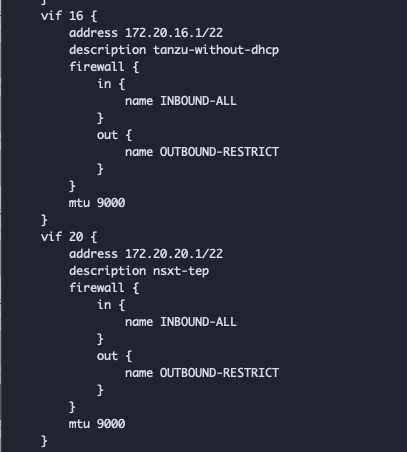

# Welcome to my Technical Documentations

I use this page to document all kinds of stuff because I am getting old and rusty and forget things.
So this page is mainly for me but I'm happy if others can benefit from it as well :slight_smile:.

## Upcoming

* Configure airgapped TKGS homelab environment using vyos

    

## Disclaimer

Every content on this page represents my personal experiences and personal view only.
