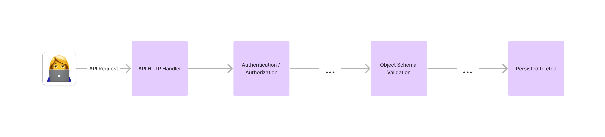
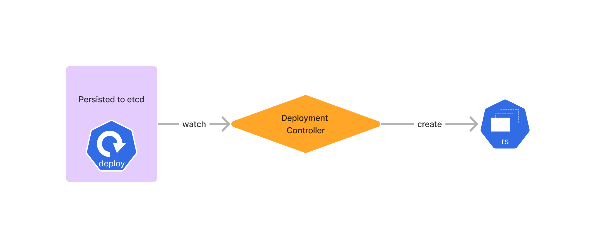
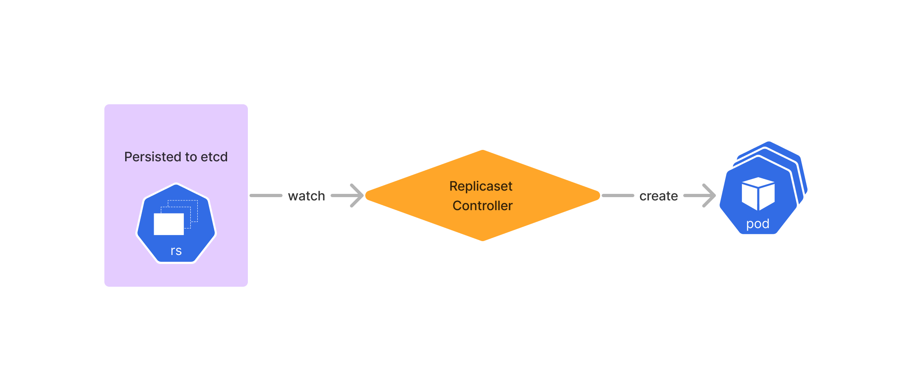
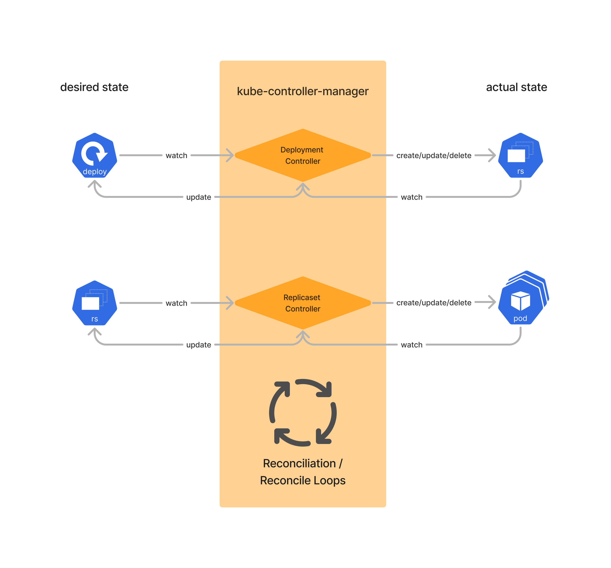

# Kubernetes Architecture Concepts

This page explains the basic concepts of the Kubernetes technical architecture which I find very important to better understand Kubernetes as a whole.

## Goal of this page

Kubernetes has evolved from just being a container scheduling and management system. It can be used as a generic "platform API" - a standardized API for an entire platform consisting of not only containers, but also virtual machines, databases and services. The reason for this success is due to the well architected architecture in my opinion.

This is the reason why I think it is very valuable to understand the basic technical concepts as it will help you better understand literally *anything* in Kubernetes.

!!! warning ""
    I try to go into technical details without going into technical details :wink:.

We will cover:

- what actually happens when I create a Kubernetes deployment?
- Kubernetes Reconciliation
- Kubernetes Admission Webhooks - Mutating and Validating
- Custom Resource Definitions (CRDs)

## What happens when I create a Kubernetes deployment?

In order to deploy a simple `nginx` deployment with 3 replicas, we create a file `nginx-deployment.yaml`:

```yaml
---
apiVersion: apps/v1
kind: Deployment
metadata:
  creationTimestamp: null
  labels:
    app: nginx
  name: nginx
spec:
  replicas: 3
  selector:
    matchLabels:
      app: nginx
  strategy: {}
  template:
    metadata:
      creationTimestamp: null
      labels:
        app: nginx
    spec:
      containers:
      - image: nginx
        name: nginx
        resources: {}
```

and apply it on a Kubernetes cluster with `kubectl apply -f nginx-deployment.yaml`, which will ultimately run 3 pods of nginx. Actually, a deployment does not create 3 pods but the deployment creates a replicaset, and the replicaset will run the 3 pods.

But how does that work?

Let's look into the simplified Kubernetes API request:



When executing `kubectl apply -f nginx-deployment.yaml`, multiple things happen which we will divide into 3 steps:

### Store Deployment Manifest in etcd

1. we hit the Kubernetes API Server, often running as a pod `kube-apiserver` itself on the Kubernetes cluster
1. the `API HTTP Handler` takes the incoming request and forwards it to `Authentication` & `Authorization` - [Kubernetes Role Based Access Control (RBAC)](https://kubernetes.io/docs/reference/access-authn-authz/rbac/). If Kubernetes RBAC denies the request, the API server responds with a `permission denied` error and stops the request from being continued to the subsequent steps.
1. If RBAC approves, the request will be handled by further steps as explained below and end up in `Object Schema Validation`. This step validates if the request is a valid yaml/json and also validates if all fields are correct. For instance, if you have a typo in your Deployment's spec, e.g. in `replicas`:

    ```yaml
    [...]
    spec:
      replica: 3
      selector:
        matchLabels:
          app: nginx
    [...]
    ```

    where we missed the "s" in `replicas`, this step will respond with 

    ```sh
    Error from server (BadRequest): error when creating "nginx-deployment.yaml": Deployment in version "v1" cannot be handled as a Deployment: strict decoding error: unknown field "spec.replica"
    ```

1. If we have a valid yaml and the syntax is correct, our `nginx-deployment.yaml` will be persisted in [etcd, the distributed key-value store in Kubernetes](https://kubernetes.io/docs/concepts/overview/components/#etcd).

!!! note
    The Kubernetes deployment manifest is now stored in etcd. There is no running pod yet though! At this point, `kubectl apply` completed its job and returns with `deployment.apps/nginx created`, essentially a `200 OK`. All subsequent steps necessary to ultimately run a pod are handled **asynchronously**.

### etcd Watch API and Controllers

As soon as the deployment manifest is stored in etcd, a key feature of etcd kicks in, the [etcd Watch API](https://etcd.io/docs/v3.5/learning/api/#watch-api) which *provides an event-based interface for asynchronously monitoring changes to keys. An etcd watch waits for changes to keys by continuously watching from a given revision, either current or historical, and streams key updates back to the client.* This API is heavily used by Kubernetes.

Let's look at our example:



There is a `Deployment controller` watching for changes of `kind: Deployment` in etcd and then determining whether it's a `Create`, `Update` or `Delete` event. In our example, it's a `Create` event and thus, the Deployment Controller will create a Replicaset which will look similar to this

```yaml
apiVersion: apps/v1
kind: ReplicaSet
metadata:
  [...]
  labels:
    app: nginx
  name: nginx-bf5d5cf98
  namespace: default
  [...]
spec:
  replicas: 3
  selector:
    matchLabels:
      app: nginx
  template:
    metadata:
      labels:
        app: nginx
    spec:
      containers:
      - image: nginx
        name: nginx
        [...]
```

The Deployment Controller applies this manifest to the API Server the same way as the user applied the deployment manifest. Hence, it will first hit the `API HTTP Handler`, `Authentication / Authorization (RBAC)`, `Object Schema Validation` and after some other steps be persisted in etcd.

 This update in etcd triggers another controller, the `Replicaset Controller` and the entire process starts over again:



The Replicaset Controller ultimately persists the pod manifest in etcd.

### Start the containers

Once a pod manifest is stored in etcd, the same mechanisms apply:

1. the [kube-scheduler](https://kubernetes.io/docs/concepts/overview/components/#kube-scheduler) watches etcd for pod events and based on the `Create` event, it assigns the pod to a suitable node in the cluster based on resource availability and other constraints. It also updates the pod's status in etcd to reflect its node assignment.
1. The [kubelet](https://kubernetes.io/docs/concepts/overview/components/#kubelet) on the assigned node also watches etcd for pod events and if there is a node assignment in the pod's spec, it will pull the necessary container images, start the containers and set up networking.
1. The [container runtime](https://kubernetes.io/docs/concepts/overview/components/#container-runtime) which is installed on the cluster will ultimately run the containers.

## Reconciliation

We've seen the `Deployment Controller` and `Replicaset Controller` how they watch etcd and react on specific changes in etcd. We've also seen that other processes, like `kube-scheduler` and `kubelet` work in a similar way in that they watch etcd for changes. All these so-called controllers do not only create/update/delete other resources but also report back the current status.

(Almost) Every resource in Kubernetes has the following similar structure:

```yaml
---
apiVersion: [APIGroup]/[APIGroupVersion]
kind: [KIND]
metadata:
  [...]
spec:
  [...]
status:
  [...]
```

where

- `spec` is what get's created/updated from one controller
- `status` is where another controller reports back the current status

We call the `spec` the **desired state**, and the `status` the **actual state**.

Let's look at our example:

1. when the end user (e.g. a developer) creates a deployment manifest and applies it to the API Server to store it in etcd, then the user applies the desired state as described in the `spec`
1. when a deployment controller gets triggered on this event, it
   1. creates a replicaset manifest by applying the desired state in the spec and applies it to the API Server to store it in etcd
   1. updates the deployment manifest, which has been initially created by the end user, by updating the `status` block with information gathered from the created replicaset
1. when the replicaset controller gets triggered on the replicaset event in etcd, it
   1. creates one or more pod manifests by applying the desired state in the spec and applies it to the API Server to store it in etcd
   1. updates the replicaset manifest, which has been initially created by the Deployment Controller, by updating the `status` block with information gathered from the pods
1. this process goes on in the same way for all other controllers

The Deployment Controller and Replicaset Controller are built-in upstream Kubernetes controllers which are, amongst several other controllers, bundled in [kube-controller-manager](https://kubernetes.io/docs/concepts/overview/components/#kube-controller-manager).

The previously described process can be summarized in this picture:



This process of constantly watching the desired state and syncing with the actual state is called **Reconciliation** - controllers reconcile the desired state with the actual state.

It is important to know who is the owner of a resource in order to determine the desired state and what should be reconciled: In our example, the replicaset manifest stored in etcd is the desired state for the Replicaset Controller. But updating the replicaset manifest, e.g. with `kubectl edit replicaset`, does not update the pods - although this is the replicaset controller's job. The replicaset manifest is owned by the Deployment Controller, whose desired state is stored in the deployment manifest. Hence, the manual changes in the replicaset manifest will be reverted back to what's desired in the deployment manifest. Resource owners are referenced in the corresponding resource:

```yaml
apiVersion: apps/v1
kind: ReplicaSet
metadata:
  [...]
  name: nginx-bf5d5cf98
  namespace: default
  ownerReferences:
  - apiVersion: apps/v1
    blockOwnerDeletion: true
    controller: true
    kind: Deployment
    name: nginx
    uid: 7063121f-1e39-4b03-96c1-d14edf24713d
  [...]
```


