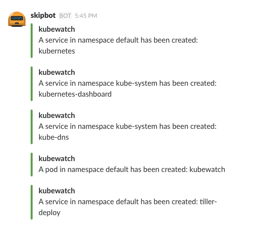

# Kubernetes Architecture Concepts

This page explains the basic concepts of the Kubernetes technical architecture which I find very important to better understand Kubernetes as a whole.

## Goal of this page

Kubernetes has evolved from just being a container scheduling and management system. It can be used as a generic "platform API" - a standardized API for an entire platform consisting of not only containers, but also virtual machines, databases and services. The reason for this success is due to the well architected architecture in my opinion.

This is the reason why I think it is very valuable to understand the basic technical concepts as it will help you better understand literally *anything* in Kubernetes.

!!! warning ""
    I try to go into technical details without going into technical details :wink:

We will cover:

- what actually happens when I create a Kubernetes deployment?
- Kubernetes Reconciliation
- Kubernetes Admission Webhooks - Mutating and Validating
- Custom Resource Definitions (CRDs)

## What happens when I create a Kubernetes deployment?

In order to deploy a simple `nginx` deployment with 3 replicas, we create a file `nginx-deployment.yaml`:

```yaml
---
apiVersion: apps/v1
kind: Deployment
metadata:
  creationTimestamp: null
  labels:
    app: nginx
  name: nginx
spec:
  replicas: 3
  selector:
    matchLabels:
      app: nginx
  strategy: {}
  template:
    metadata:
      creationTimestamp: null
      labels:
        app: nginx
    spec:
      containers:
      - image: nginx
        name: nginx
        resources: {}
```

and apply it on a Kubernetes cluster with `kubectl apply -f nginx-deployment.yaml`, which will ultimately run 3 pods of nginx. Actually, a deployment does not create 3 pods but the deployment creates a replicaset, and the replicaset will run the 3 pods.

But how does that work?

Let's look into the simplified Kubernetes API request:


When executing `kubectl apply -f nginx-deployment.yaml`, multiple things happen which we will divide into 3 steps:

### Store Deployment Manifest in etcd

1. we hit the Kubernetes API Server, often running as a pod `kube-apiserver` itself on the Kubernetes cluster
1. the `API HTTP Handler` takes the incoming request and forwards it to `Authentication` & `Authorization` - [Kubernetes Role Based Access Control (RBAC)](https://kubernetes.io/docs/reference/access-authn-authz/rbac/). If Kubernetes RBAC denies the request, the API server responds with a `permission denied` error and stops the request from being continued to the subsequent steps.
1. If RBAC approves, the request will be handled by further steps as explained below and end up in `Object Schema Validation`. This step validates if the request is a valid yaml/json and also validates if all fields are correct. For instance, if you have a typo in your Deployment's spec, e.g. in `replicas`:

    ```yaml
    [...]
    spec:
      replica: 3
      selector:
        matchLabels:
          app: nginx
    [...]
    ```

    where we missed the "s" in `replicas`, this step will respond with 

    ```sh
    Error from server (BadRequest): error when creating "nginx-deployment.yaml": Deployment in version "v1" cannot be handled as a Deployment: strict decoding error: unknown field "spec.replica"
    ```

1. If we have a valid yaml and the syntax is correct, our `nginx-deployment.yaml` will be persisted in [etcd, the distributed key-value store in Kubernetes](https://kubernetes.io/docs/concepts/overview/components/#etcd).

!!! note
    The Kubernetes deployment manifest is now stored in etcd. There is no running pod yet though! At this point, `kubectl apply` completed its job and returns with `deployment.apps/nginx created`, essentially a `200 OK`. All subsequent steps necessary to ultimately run a pod are handled **asynchronously**.

### etcd Watch API and Controllers

As soon as the deployment manifest is stored in etcd, a key feature of etcd kicks in, the [etcd Watch API](https://etcd.io/docs/v3.5/learning/api/#watch-api) which *provides an event-based interface for asynchronously monitoring changes to keys. An etcd watch waits for changes to keys by continuously watching from a given revision, either current or historical, and streams key updates back to the client.* This API is heavily used by Kubernetes.

Let's look at our example:


There is a `Deployment controller` watching for changes of `kind: Deployment` in etcd and then determining whether it's a `Create`, `Update` or `Delete` event. In our example, it's a `Create` event and thus, the Deployment Controller will create a Replicaset which will look similar to this

```yaml
apiVersion: apps/v1
kind: ReplicaSet
metadata:
  [...]
  labels:
    app: nginx
  name: nginx-bf5d5cf98
  namespace: default
  [...]
spec:
  replicas: 3
  selector:
    matchLabels:
      app: nginx
  template:
    metadata:
      labels:
        app: nginx
    spec:
      containers:
      - image: nginx
        name: nginx
        [...]
```

The Deployment Controller applies this manifest to the API Server the same way as the user applied the deployment manifest. Hence, it will first hit the `API HTTP Handler`, `Authentication / Authorization (RBAC)`, `Object Schema Validation` and after some other steps be persisted in etcd.

 This update in etcd triggers another controller, the `Replicaset Controller` and the entire process starts over again:


The Replicaset Controller ultimately persists the pod manifest in etcd.

### Start the containers

Once a pod manifest is stored in etcd, the same mechanisms apply:

1. the [kube-scheduler](https://kubernetes.io/docs/concepts/overview/components/#kube-scheduler) watches etcd for pod events and based on the `Create` event, it assigns the pod to a suitable node in the cluster based on resource availability and other constraints. It also updates the pod's status in etcd to reflect its node assignment.
1. The [kubelet](https://kubernetes.io/docs/concepts/overview/components/#kubelet) on the assigned node also watches etcd for pod events and if there is a node assignment in the pod's spec, it will pull the necessary container images, start the containers and set up networking.
1. The [container runtime](https://kubernetes.io/docs/concepts/overview/components/#container-runtime) which is installed on the cluster will ultimately run the containers.

## Reconciliation

We've seen the `Deployment Controller` and `Replicaset Controller` how they watch etcd and react on specific changes in etcd. We've also seen that other processes, like `kube-scheduler` and `kubelet` work in a similar way in that they watch etcd for changes. All these so-called controllers do not only create/update/delete other resources but also report back the current status.

(Almost) Every resource in Kubernetes has the following similar structure:

```yaml
---
apiVersion: [APIGroup]/[APIGroupVersion]
kind: [KIND]
metadata:
  [...]
spec:
  [...]
status:
  [...]
```

where

- `spec` is what get's created/updated from one controller
- `status` is where another controller reports back the current status

We call the `spec` the **desired state**, and the `status` the **actual state**.

Let's look at our example:

1. when the end user (e.g. a developer) creates a deployment manifest and applies it to the API Server to store it in etcd, then the user applies the desired state as described in the `spec`
1. when a deployment controller gets triggered on this event, it
   1. creates a replicaset manifest by applying the desired state in the spec and applies it to the API Server to store it in etcd
   1. updates the deployment manifest, which has been initially created by the end user, by updating the `status` block with information gathered from the created replicaset
1. when the replicaset controller gets triggered on the replicaset event in etcd, it
   1. creates one or more pod manifests by applying the desired state in the spec and applies it to the API Server to store it in etcd
   1. updates the replicaset manifest, which has been initially created by the Deployment Controller, by updating the `status` block with information gathered from the pods
1. this process goes on in the same way for all other controllers

The Deployment Controller and Replicaset Controller are built-in upstream Kubernetes controllers which are, amongst several other controllers, bundled in [kube-controller-manager](https://kubernetes.io/docs/concepts/overview/components/#kube-controller-manager).

The previously described process can be summarized in this picture:


This process of constantly watching the desired state and syncing with the actual state is called **Reconciliation** - controllers reconcile the desired state with the actual state.

It is important to know who is the owner of a resource in order to determine the desired state and what should be reconciled: In our example, the replicaset manifest stored in etcd is the desired state for the Replicaset Controller. But updating the replicaset manifest, e.g. with `kubectl edit replicaset`, does not update the pods - although this is the replicaset controller's job. The replicaset manifest is owned by the Deployment Controller, whose desired state is stored in the deployment manifest. Hence, the manual changes in the replicaset manifest will be reverted back to what's desired in the deployment manifest. Resource owners are referenced in the corresponding resource:

```yaml
apiVersion: apps/v1
kind: ReplicaSet
metadata:
  [...]
  name: nginx-bf5d5cf98
  namespace: default
  ownerReferences:
  - apiVersion: apps/v1
    blockOwnerDeletion: true
    controller: true
    kind: Deployment
    name: nginx
    uid: 7063121f-1e39-4b03-96c1-d14edf24713d
  [...]
```

## Admission Controllers

We've looked into a simplified Kubernetes API request flow when we explored [what happens when we create a Kubernetes deployment](#what-happens-when-i-create-a-kubernetes-deployment) where we haven't covered two steps - `Mutating Admission` and `Validating Admission`:


!!! quote "From the [Kubernetes docs](https://kubernetes.io/docs/reference/access-authn-authz/admission-controllers/):"
    An admission controller is a piece of code that intercepts requests to the Kubernetes API server prior to persistence of the object, but after the request is authenticated and authorized.

    Admission controllers may be validating, mutating, or both. Mutating controllers may modify objects related to the requests they admit; validating controllers may not.

    Admission controllers limit requests to create, delete, modify objects. Admission controllers can also block custom verbs, such as a request connect to a Pod via an API server proxy. Admission controllers do not (and cannot) block requests to read (get, watch or list) objects.

Simply put, the mutating admission step will alter your manifest and the validating admission will allow or deny your request.

### Admission Controller Example

Let's look into our example and let's assume there is a **AddLabel** mutating admission controller implemented that injects a label `team: <TeamName>` to every request's manifest and there is a **RequiredLabel** validating admission controller implemented that expects a `cost-center: <CostCenterID>` label on every manifest.

When we create a new deployment using

```yaml
---
apiVersion: apps/v1
kind: Deployment
metadata:
  creationTimestamp: null
  labels:
    app: nginx
  name: nginx
spec:
  replicas: 3
  selector:
    matchLabels:
      app: nginx
  strategy: {}
  template:
    metadata:
      creationTimestamp: null
      labels:
        app: nginx
    spec:
      containers:
      - image: nginx
        name: nginx
        resources: {}
```

then the mutating admission controller `AddLabel` will inject the label `team: AwesomeTeam`, so the request becomes

```yaml
---
apiVersion: apps/v1
kind: Deployment
metadata:
  creationTimestamp: null
  labels:
    app: nginx
    team: AwesomeTeam
  name: nginx
spec:
  replicas: 3
  selector:
    matchLabels:
      app: nginx
  strategy: {}
  template:
    metadata:
      creationTimestamp: null
      labels:
        app: nginx
    spec:
      containers:
      - image: nginx
        name: nginx
        resources: {}
```

The request then passes the `Object Schema Validation` step as there is no syntax error, but the request is denied on the `Validating Admission` step because the label `cost-center` is missing.

When using

```yaml
---
apiVersion: apps/v1
kind: Deployment
metadata:
  creationTimestamp: null
  labels:
    app: nginx
    cost-center: 12345
  name: nginx
spec:
  replicas: 3
  selector:
    matchLabels:
      app: nginx
  strategy: {}
  template:
    metadata:
      creationTimestamp: null
      labels:
        app: nginx
    spec:
      containers:
      - image: nginx
        name: nginx
        resources: {}
```

the request passes the API workflow and gets stored in etcd as

```yaml
---
apiVersion: apps/v1
kind: Deployment
metadata:
  creationTimestamp: null
  labels:
    app: nginx
    cost-center: 12345
    team: AwesomeTeam
  name: nginx
spec:
  replicas: 3
  selector:
    matchLabels:
      app: nginx
  strategy: {}
  template:
    metadata:
      creationTimestamp: null
      labels:
        app: nginx
    spec:
      containers:
      - image: nginx
        name: nginx
        resources: {}
```

### Built-In Admission Controllers

There are [various admission controllers](https://kubernetes.io/docs/reference/access-authn-authz/admission-controllers/#what-does-each-admission-controller-do) compiled into the `kube-apiserver` binary which Kubernetes Administrators can turn on and off with some [default ones being turned on](https://kubernetes.io/docs/reference/access-authn-authz/admission-controllers/#which-plugins-are-enabled-by-default).

### Dynamic Admission Controllers

!!! quote "[Kubernetes docs](https://kubernetes.io/docs/reference/access-authn-authz/extensible-admission-controllers/)"
    In addition to compiled-in admission plugins, admission plugins can be developed as extensions and run as webhooks configured at runtime. [...] Admission webhooks are HTTP callbacks that receive admission requests and do something with them.

Simply put, the Kubernetes API exposes the **Mutating Admission** and **Validating Admission** interfaces so that you can write external custom software and extend those two api workflow steps.

The [example from above](#admission-controller-example) explains two possible custom implementations of a mutating and validating admission webhook.

The most famous open source projects that implement both webhooks are [Kyverno](https://github.com/kyverno/kyverno) and [Open Policy Agent Gatekeeper](https://github.com/open-policy-agent/gatekeeper).

You can read more about admission controllers on this blog post: [A Guide to Kubernetes Admission Controllers](https://kubernetes.io/blog/2019/03/21/a-guide-to-kubernetes-admission-controllers/#what-are-kubernetes-admission-controllers).

## Extending Kubernetes

### Custom Resources and Custom Controllers

We have seen that [Dynamic Admission Controllers](#dynamic-admission-controllers) allows to hook into the Kubernetes API and extend it with custom software.

With the introduction of [Custom Resources](https://kubernetes.io/docs/concepts/extend-kubernetes/api-extension/custom-resources/) you can further extend Kubernetes by writing custom controllers and hook into the etcd Watch API the same way as it's done with the Deployment Controller or Replicaset Controller as [explained above](#what-happens-when-i-create-a-kubernetes-deployment).

A simple custom controller is [kubewatch](https://github.com/robusta-dev/kubewatch) which basically looks for events like pod/deployment/confimap creation/update/deletion and send a notification to selected channels like slack, hipchat, mattermost or webhook:



### Custom Resource Definitions (CRDs) and Operators

Custom Controllers can be implemented to use the etcd Watch API and watch for built-in Kubernetes resources, such as deployments, services or pods, as described in the previous section. This approach can be further extended by implementing own resources, and not only relying on built-in resources.

Let's look at a simple example: In order to deploy a web application we probably need a `deployment` to deploy the application in pods, a `service` to make the application available to end users, a `configmap` to store application configuration and a `secret` to store application secrets. Let's assume, we work for `mycompany` and we have implemented an app called `shopping-cart` which uses an external Postgres database and uses S3 for storing files. For this, we could introduce a custom resource called `WebApp` which would look like:

```yaml
---
apiVersion: apps.com.mycompany/v1
kind: WebApp
metadata:
  labels:
    app: shopping-cart
  name: shopping-cart
spec:
  replicas: 3
  image: registry.mycompany.com/shopping-cart/shopping-cart:v1.0.0
  config:
    env: prod
    postgresURL: postgres.mycompany.com:5432
    s3URL: 
    s3Bucket: shopping-cart
  secret:
    postgresUser: pg
    postGresPasswort: sup€rs3cure!
    s3AccessKeyID: JWQWDBWM2
    s3SecretAccessKey: nTqfIa4AvynIEWG7cTmY
```

!!! tip
    Never store secrets in plaintext! This is just an example, so please forgive me 😉

We can then apply this `WebApp` onto our cluster

```shell
kubectl apply -f shopping-cart-webapp.yaml
```

which will ultimately create a `deployment`, `service`, `configmap` and a `secret`.

!!! note
    This is just a simple example. This can be further extended to abstract away required logic from developers. So we can think of the `WebApp` being a custom resource owned by platform admins who can implement all required details to standardize web application deployments  within the company. This could include implementing security requirements and other best practices whilst developers can focus on their application code.

**How can this be implemented?**

The `WebApp` is a **Custom Resource Definition (CRD)** - a custom API registered in the Kubernetes API. To make that work technically, you have to describe and register the `WebApp` API by creating a CRD:

```yaml
apiVersion: apiextensions.k8s.io/v1
kind: CustomResourceDefinition
metadata:
  name: webapps.apps.com.mycompany
spec:
  group: apps.com.mycompany
  versions:
    - name: v1
      served: true
      storage: true
      schema:
        openAPIV3Schema:
          type: object
          properties:
            spec:
              type: object
              properties:
                replicas:
                  type: string
                image:
                  type: string
                config:
                  type: object
                  properties:
                    env:
                      type: string
                    postgresURL:
                      type: string
                    s3URL:
                      type: string
                    s3Bucket:
                      type: string
                secret:
                  type: object
                  properties:
                    postgresURL:
                      type: string
                    postGresPasswort:
                      type: string
                    s3AccessKeyID:
                      type: string
                    s3SecretAccessKey:
                      type: string
  # either Namespaced or Cluster
  scope: Namespaced
  names:
    # plural name to be used in the URL: /apis/<group>/<version>/<plural>
    plural: webapps
    # singular name to be used as an alias on the CLI and for display
    singular: webapp
    # kind is normally the CamelCased singular type. Your resource manifests use this.
    kind: WebApp
    # shortNames allow shorter string to match your resource on the CLI
    shortNames:
    - wa
```

which we can simply register in Kubernetes with

```shell
kubectl apply -f webapp-crd.yaml
```

Afterwards we can already execute

```shell
kubectl get webapp
# or using the short name
kubectl get wa
# and because it's namespaced
kubectl get wa --all-namespaces
```

we can actually also already apply our manifest from above. But this will solely store the manifest in etcd (after it passes all API workflow steps as described in [Store Deployment Manifest in etcd](#store-deployment-manifest-in-etcd)). Until now, there is no controller that watches etcd for resources of `kind: WebApp`. Therefore, the next step is to implement such a custom controller - custom controllers that watch Custom Resource Definitions are called [Operators](https://kubernetes.io/docs/concepts/extend-kubernetes/operator/).

## Summary

The Kubernetes project started in 6th June 2014 to become a *Production-Grade Container Scheduling and Management system* and has since evolved to be way more than that - with the possibility of extending the Kubernetes API with admission controllers and Kubernetes itself with Custom Controller and Operator, Kubernetes can be used as a standardized Platform API. All these implementation patterns build on top of the paradigm of an asynchronous event based architecture with etcd and the controller pattern at the heart of it. This is the main reason for success of the Kubernetes project in my opinion.

## Further interesting resources

- [What happens when ... Kubernetes edition!](https://github.com/jamiehannaford/what-happens-when-k8s)
- [OperatorHub.io](https://operatorhub.io/)
- [How does the Kubernetes scheduler work?](https://jvns.ca/blog/2017/07/27/how-does-the-kubernetes-scheduler-work/)
