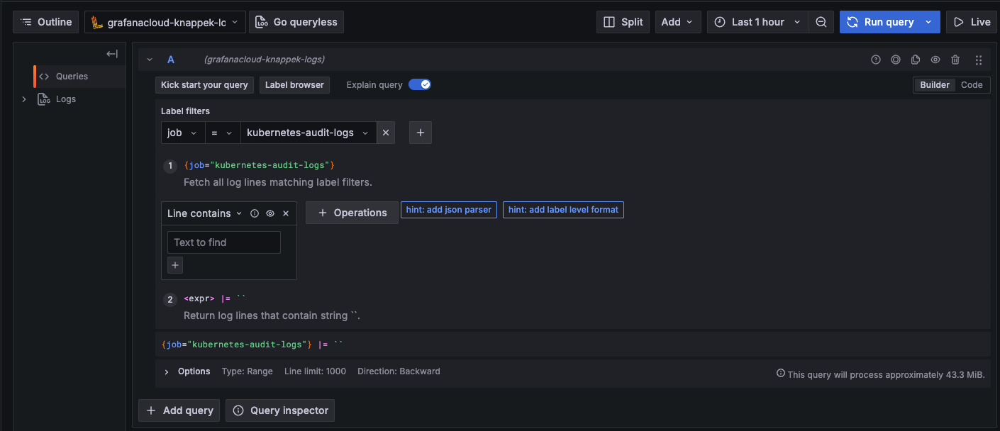

# Write K8s Audit Logs to Loki in Grafana Cloud

This page explains how to send Kubernetes audit logs to Loki using Grafana Cloud.

## Prerequisites

- [Grafana Cloud Account](https://grafana.com/products/cloud/)
- Kubernetes Cluster with Auditing enabled: See [Customize Kubernetes Auditing](./../tanzu/tkgs/customize-k8s-auditing.md) for an example

## Send logs using Promtail

We deploy the [Promtail Agent](https://grafana.com/docs/loki/latest/send-data/promtail/) and configure it to ship (only) Kubernetes Audit Logs to [Grafana Loki](https://grafana.com/docs/loki/latest/) running in Grafana Cloud.

1. Get your Grafana Cloud Credentials: 
      1. Navigate to your [Grafana Cloud Account](https://grafana.com/auth/sign-in)
      1. next to your account, click the `Launch` button
      1. navigate to the **Loki** Stack and click `Send Logs`
      1. Click one of the `Generate now` buttons to generate an API token make a note of that token
      1. record your username, which is a 5-digit number, which you can also find on the top of that page
      1. make a note of the `URL`
1. Create a file called `promtail-config.yaml`:

    ```yaml
    apiVersion: v1
    kind: ConfigMap
    metadata:
      name: promtail-config
      namespace: promtail
    data:
      promtail-config.yaml: |
        server:
          http_listen_port: 3101
          grpc_listen_port: 0

        clients:
          - url: "<URL recorded from previous step>/loki/api/v1/push"
            basic_auth:
              username: "<USER recorded from previous step>"
              password: "<API TOKEN generated in previous step>"

        scrape_configs:
          - job_name: kubernetes-audit-logs
            static_configs:
              - targets:
                  - localhost
                labels:
                  job: "kubernetes-audit-logs"
                  __path__: /var/log/kubernetes/kube-apiserver.log

    ```

    !!! info
        You might need to adapt `__path__` depending on what's configured for `--audit-log-path` as the kube-apiserver flag.

1. Create a file called `promtail-daemonset.yaml`:

    ```yaml
    apiVersion: apps/v1
    kind: DaemonSet
    metadata:
      name: promtail
      namespace: promtail
    spec:
      selector:
        matchLabels:
          name: promtail
      template:
        metadata:
          labels:
            name: promtail
        spec:
          serviceAccountName: promtail
          tolerations:
            - key: "node-role.kubernetes.io/control-plane"
              operator: "Exists"
              effect: "NoSchedule"
          containers:
            - name: promtail
              image: grafana/promtail:latest
              args:
                - "-config.file=/etc/promtail/promtail-config.yaml"
              volumeMounts:
                - name: config
                  mountPath: /etc/promtail
                - name: audit-logs
                  mountPath: /var/log/kubernetes
                  readOnly: true
          volumes:
            - name: config
              configMap:
                name: promtail-config
            - name: audit-logs
              hostPath:
                path: /var/log/kubernetes
                type: DirectoryOrCreate
    ```

1. Create a file called `promtail-rbac.yaml`:

    ```yaml
    ---
    apiVersion: v1
    kind: ServiceAccount
    metadata:
      name: promtail
      namespace: promtail

    ---
    apiVersion: rbac.authorization.k8s.io/v1
    kind: ClusterRole
    metadata:
      name: promtail
    rules:
      - apiGroups: [""]
        resources: ["pods", "nodes", "namespaces"]
        verbs: ["get", "list", "watch"]

    ---
    apiVersion: rbac.authorization.k8s.io/v1
    kind: ClusterRoleBinding
    metadata:
      name: promtail
    roleRef:
      apiGroup: rbac.authorization.k8s.io
      kind: ClusterRole
      name: promtail
    subjects:
      - kind: ServiceAccount
        name: promtail
        namespace: promtail
    ```

1. Create all resources on your Kubernetes Cluster:

    ```sh
    kubectl create ns promtail
    kubectl apply -f promtail-rbac.yaml
    kubectl apply -f promtail-config.yaml
    kubectl apply -f promtail-daemonset.yaml
    ```

## Query Logs in Grafana Cloud

1. In your [Grafana Cloud Account](https://grafana.com/auth/sign-in) page, navigate to the **Grafana** stack and click the `Launch` button
1. Navigate to **Explore**
1. Use the filter `job=kubernetes-audit-log` as you see here:

    

1. Click `Run query`
