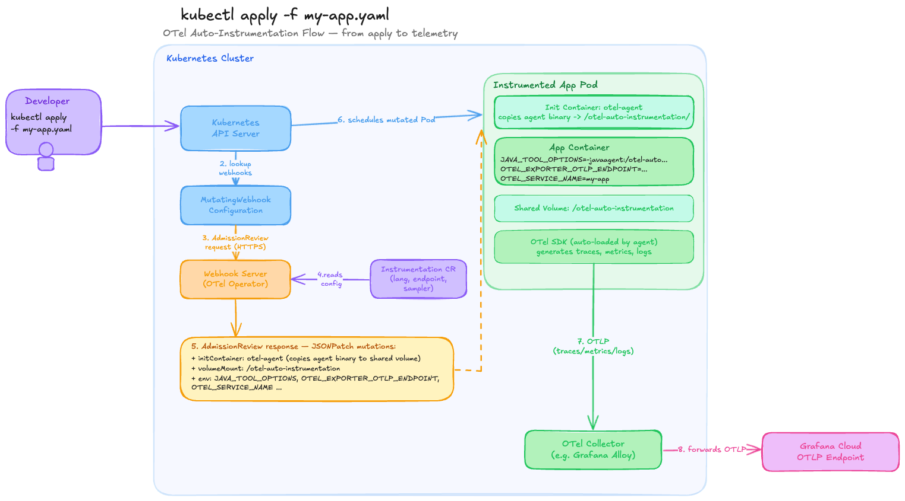

# Zero-Code Java Auto-Instrumentation with the Kubernetes OpenTelemetry Operator

This guide extends the [Grafana OpenTelemetry Workshop](https://grafana.github.io/opentelemetry-workshop/) and walks through deploying the OpenTelemetry Operator on Kubernetes and using it to automatically instrument a Java application — without modifying a single line of application code or adding any OTel dependencies.

## How it works

The OpenTelemetry Operator runs as a Kubernetes controller and installs a [mutating admission webhook](https://kubernetes.io/docs/reference/access-authn-authz/extensible-admission-controllers/) into your cluster. A mutating admission webhook intercepts API server requests (in this case `Pod` creation) and can modify the object before it is persisted. The operator uses this to inject instrumentation transparently.

When you annotate a Pod template, here is exactly what happens at creation time:



Here's the focused `kubectl apply` flow, numbered step by step:

1. **Developer runs `kubectl apply -f my-app.yaml`** — the Deployment and Service manifest is POSTed to the API Server
2. **API Server looks up MutatingWebhookConfiguration** — sees a rule matching Pod creates in the annotated namespace
3. **AdmissionReview request sent to the Webhook Server** (OTel Operator) over HTTPS
4. **Webhook Server reads the Instrumentation CR (Custom Resource)** — pulls the language, OTLP endpoint, sampler, and resource attribute config
5. **Webhook returns a JSONPatch** — three mutations: an init container (copies the Opentelemetry agent binary), a shared volume mount, and the `OTEL_*` env vars
6. **API Server schedules the mutated Pod** — Kubernetes sees the patched spec as if you'd written it yourself
7. **OTel SDK auto-loads in the app container** — no code change needed; sends OTLP telemetry to the OpenTelemetry Collector (e.g. Grafana Alloy)
8. **Collector forwards to Grafana Cloud OTLP endpoint** which ultimately stores metrics in Grafana Cloud Metrics (Mimir), logs in Grafana Cloud Logs (Loki), traces in Grafana Cloud Traces (Tempo) and, if enabled, profiles in Grafana Cloud Profiles (Pyroscope).

The operator introduces two new custom resources (CRDs):

- **`OpenTelemetryCollector`** — deploy and manage an OTel Collector instance inside your cluster. In this lab, we won't deploy the OpenTelemetry Collector but use [Grafana Alloy](https://grafana.com/docs/alloy/latest/) instead, deployed separately from the Operator.
- **`Instrumentation`** — define the instrumentation configuration (exporter endpoint, propagators, sampler) that the webhook reads when injecting into pods.

In this workshop, we are basically following this official OpenTelemetry documentation about [Injecting Auto-instrumentation](https://opentelemetry.io/docs/platforms/kubernetes/operator/automatic/).

---

## Prerequisites

- `kubectl` and `helm` installed
- Docker (to build and push the app image)

---

## Step 1 — Create a kind cluster

We use [kind](https://kind.sigs.k8s.io/) to deploy a local Kubernetes cluster running on your laptop. You can use any other Kubernetes cluster of your choice if you already have one.

Create a multi-node kind cluster as explained [here](./otel-demo-kind-grafana-cloud.md).

Verify the cluster is up and running:

```bash
kubectl get nodes
kubectl get pods -A
```

## Step 2 - Deploy the k8s-monitoring helm chart (Alloy)

Deploy the K8s-monitoring helm chart as explained [here](https://github.com/ar2pi/potato-cluster#kubernetes-monitoring).

The environment variables should look similar to this:

```
GRAFANA_METRICS_URL="https://prometheus-prod-24-prod-eu-west-2.grafana.net/api/prom/push"
GRAFANA_METRICS_USER="456789"
GRAFANA_CLUSTER_METRICS_URL="https://prometheus-prod-24-prod-eu-west-2.grafana.net/api/prom"
GRAFANA_LOGS_URL="https://logs-prod-012.grafana.net/loki/api/v1/push"
GRAFANA_LOGS_USER="234567"
GRAFANA_OTLP_URL="https://otlp-gateway-prod-eu-west-2.grafana.net/otlp"
GRAFANA_OTLP_USER="123456"
GRAFANA_PROFILES_URL="https://profiles-prod-002.grafana.net"
GRAFANA_PROFILES_USER="123456"
GRAFANA_ACCESS_TOKEN="glc_eyJv..."
```

---

## Step 3 — Install cert-manager

The OTel Operator's admission webhook must be served over HTTPS. `cert-manager` provisions and rotates the TLS certificates the webhook uses. It is a hard prerequisite — the operator will not start without it.

```bash
helm install \
  cert-manager oci://quay.io/jetstack/charts/cert-manager \
  --version v1.20.2 \
  --namespace cert-manager \
  --create-namespace \
  --set crds.enabled=true
```

---

## Step 4 — Install the OpenTelemetry Operator

```bash
helm repo add open-telemetry https://open-telemetry.github.io/opentelemetry-helm-charts
helm repo update

helm install opentelemetry-operator open-telemetry/opentelemetry-operator \
  --namespace opentelemetry-operator-system --create-namespace \
  --set "manager.collectorImage.repository=ghcr.io/open-telemetry/opentelemetry-collector-releases/opentelemetry-collector-k8s"
```

You can verify the operator registered its CRDs:

```bash
kubectl get crd | grep opentelemetry
```

---

## Step 5 — Create an Instrumentation resource

The `Instrumentation` CR (Custom Resource) is the central configuration object that the webhook consults when injecting into a pod. It specifies:

- **`exporter.endpoint`** — where to send telemetry (your OTel Collector or a Grafana Cloud OTLP endpoint)
- **`propagators`** — which context propagation formats to use across service boundaries
- **`sampler`** — what fraction of traces to record
- **`java`** — Java-specific settings (agent image, extra env vars, resource requirements)

```bash
kubectl apply -f - <<EOF
apiVersion: opentelemetry.io/v1alpha1
kind: Instrumentation
metadata:
  name: demo-instrumentation
  namespace: default
spec:
  exporter:
    endpoint: http://grafana-k8s-monitoring-alloy-receiver.monitoring:4317
  propagators:
    - tracecontext
    - baggage
  sampler:
    type: parentbased_traceidratio
    argument: "1"
EOF
```

Verify it was created:

```bash
kubectl get instrumentation -n default
# or for more detail:
kubectl describe instrumentation demo-instrumentation -n default
```

!!! note
    Java auto-instrumentation defaults to OTLP `gRPC` on port `4317`. This is different from the `http/protobuf` protocol on port `4318` used by some other languages. If your collector only exposes `http/protobuf`, you can override the protocol per-language in the `java.env` section (see [Java-specific configuration](#java-specific-configuration) below).

!!! warning "Namespace and deployment order matter"
    The `Instrumentation` CR must exist in the cluster *before* your application pods are created. If you deploy the app first, the webhook will find no CR to reference and injection will be skipped. Also, the annotation in the deployment references this resource as `default/demo-instrumentation` — the `namespace/name` prefix is required when the instrumentation resource lives in a different namespace than the pod.

---

## Step 6 — The Java application

The `rolldice` app ([source code](https://github.com/grafana/opentelemetry-workshop/tree/main/source/rolldice)) is a minimal Spring Boot service that exposes `/rolldice` and returns a random dice roll.

**`src/main/java/com/example/rolldice/RolldiceController.java`**
```java
@RestController
public class RolldiceController {

    private static final Logger logger = LoggerFactory.getLogger(RolldiceController.class);

    @GetMapping("/rolldice")
    public String index(@RequestParam("player") Optional<String> player) {
        int result = this.getRandomNumber(1, 6);
        if (player.isPresent()) {
            logger.info("Player {} is rolling the dice, result: {}", player.get(), result);
        } else {
            logger.info("Anonymous player is rolling the dice, result: {}", result);
        }
        return Integer.toString(result) + "\n";
    }
    ...
}
```

Notice what is **absent** from [pom.xml](https://github.com/grafana/opentelemetry-workshop/blob/main/source/rolldice/pom.xml): there are zero OpenTelemetry dependencies. The app itself is completely unaware of tracing or metrics — that is the point of zero-code instrumentation.

---

## Step 7 — Build and push the Docker image

The Dockerfile is a standard two-stage Maven build. There is no OTel agent baked in — the operator injects it at runtime via an init container. You can also find the Dockerfile [here](https://github.com/Knappek/opentelemetry-workshop/blob/main/source/rolldice/Dockerfile):

```dockerfile
FROM maven:3.9-eclipse-temurin-17 AS build
WORKDIR /app
COPY pom.xml .
RUN mvn dependency:go-offline -q
COPY src ./src
RUN mvn package -DskipTests -q

FROM eclipse-temurin:17-jre
WORKDIR /app
COPY --from=build /app/target/rolldice-0.0.1-SNAPSHOT.jar app.jar
EXPOSE 8080
ENTRYPOINT ["java", "-jar", "app.jar"]
```

Build and push (replace `knappek` with your Docker Hub username):

```bash
cd source/rolldice

docker build -t knappek/rolldice:latest .
docker push knappek/rolldice:latest
```

---

## Step 8 — Deploy the application

The Kubernetes manifests are stored [here](https://github.com/Knappek/opentelemetry-workshop/tree/main/source/rolldice/k8s).

**`deployment.yaml`**
```yaml
apiVersion: apps/v1
kind: Deployment
metadata:
  name: rolldice
  labels:
    app: rolldice
spec:
  replicas: 1
  selector:
    matchLabels:
      app: rolldice
  template:
    metadata:
      annotations:
        instrumentation.opentelemetry.io/inject-java: "default/demo-instrumentation"
      labels:
        app: rolldice
    spec:
      containers:
        - name: rolldice
          image: knappek/rolldice:latest
          ports:
            - containerPort: 8080
          readinessProbe:
            httpGet:
              path: /rolldice
              port: 8080
            initialDelaySeconds: 10
            periodSeconds: 5
          resources:
            requests:
              cpu: "100m"
              memory: "256Mi"
            limits:
              cpu: "500m"
              memory: "512Mi"
```

!!! info
    This deployment manifest actually has a bad `readinessProbe` as it executes a `GET /rolldice` request every 5 seconds and thus rolls the dice of the application. We can keep that for this demo to illustrate some traffic.

### The annotation

The single annotation `instrumentation.opentelemetry.io/inject-java: "default/demo-instrumentation"` is the entire instrumentation configuration from the app's perspective. The value tells the webhook exactly which `Instrumentation` CR to use.

The annotation value can take four forms:

| Value | Behaviour |
|-------|-----------|
| `"true"` | Inject using the single `Instrumentation` CR in the **same namespace** |
| `"my-instrumentation"` | Inject using the named CR in the **same namespace** |
| `"other-ns/my-instrumentation"` | Inject using a named CR from **a different namespace** |
| `"false"` | Explicitly **disable** injection (useful to opt out when a namespace-level annotation enables it) |

!!! warning "Annotation placement"
    The annotation must go in `spec.template.metadata.annotations` (the pod template), **not** in the top-level `metadata.annotations` on the Deployment itself. The webhook acts on Pod creation events, not Deployment events.

!!! info "Namespace-level injection"
    You can also apply the annotation to a `Namespace` object to instrument all pods in that namespace automatically, without annotating each Deployment individually. See the [Operators auto-instrumentation documentation](https://github.com/open-telemetry/opentelemetry-operator/blob/main/README.md#opentelemetry-auto-instrumentation-injection) for more details.

**`service.yaml`**
```yaml
apiVersion: v1
kind: Service
metadata:
  name: rolldice
spec:
  selector:
    app: rolldice
  ports:
    - protocol: TCP
      port: 80
      targetPort: 8080
  type: ClusterIP
```

Apply both:

```bash
kubectl apply -f deployment.yaml
kubectl apply -f service.yaml
```

---

## Step 9 — Verify the injection

### Check the init container

The clearest sign that injection succeeded is the presence of an init container on the pod. Check events for the pod:

```bash
kubectl get events -n default --field-selector reason=Created | grep opentelemetry
```

Or inspect the pod directly:

```bash
kubectl describe pod -l app=rolldice
```

Look for an init container section like:

```
Init Containers:
  opentelemetry-auto-instrumentation-java:
    Image: ghcr.io/open-telemetry/opentelemetry-operator/autoinstrumentation-java:latest
    State: Terminated (Completed)
```

### Check the injected environment variables

```bash
kubectl describe pod -l app=rolldice | grep -A 2 "JAVA_TOOL_OPTIONS\|OTEL_"
```

You should see:

```
JAVA_TOOL_OPTIONS:          -javaagent:/otel-auto-instrumentation-java/javaagent.jar
OTEL_SERVICE_NAME:          rolldice
OTEL_EXPORTER_OTLP_ENDPOINT: http://otel-collector:4318
OTEL_PROPAGATORS:           tracecontext,baggage
... // and other OTEL_ env variables
```

### Check the app logs

The Java agent prints a startup banner when it loads cleanly:

```bash
kubectl logs -l app=rolldice --tail 100 | grep -i "opentelemetry"
```

You should see a line such as:

```
[otel.javaagent 2026-...] [main] INFO io.opentelemetry.javaagent.tooling.VersionLogger - opentelemetry-javaagent - version: x.x.x
```

If you see no agent output, check the operator logs for webhook errors:

```bash
kubectl logs -l app.kubernetes.io/name=opentelemetry-operator \
  --container manager \
  -n opentelemetry-operator-system \
  --tail=50
```

---

## Step 10 — Generate traffic

!!! info
    As mentioned earlier, the `readinessProbe` of the Deployment already generates traffic

Port-forward the service and send some requests:

```bash
kubectl port-forward svc/rolldice 8080:80
```

In a separate terminal:

```bash
curl "http://localhost:8080/rolldice?player=Alice"
curl "http://localhost:8080/rolldice?player=Bob"
curl "http://localhost:8080/rolldice"
```

Traces, metrics, and logs are now flowing to the collector endpoint defined in the `Instrumentation` CR — no code changes required.

---

## Step 11 - Verify telemetry in Grafana Cloud

Navigate to your Grafana Cloud stack on `https://STACK_NAME.grafana.net/explore` and select your default Prometheus datasource. Select Label filters `service_name=rolldice` or execute the promql query

```promql
{service_name="rolldice"}
```

You can do the same using the Tempo or Loki datasource.

---

## What the operator injected (under the hood)

Inspect the full mutated pod spec to see everything the webhook added:

```bash
kubectl get pod -l app=rolldice -o yaml
```

| Addition | What it does |
|----------|-------------|
| Init container `opentelemetry-auto-instrumentation-java` | Copies the Java agent JAR into the shared volume at `/otel-auto-instrumentation-java/` |
| `emptyDir` volume `opentelemetry-auto-instrumentation-java` | Shared between the init container and the app container; exists only for the lifetime of the pod |
| `JAVA_TOOL_OPTIONS` env var | Tells the JVM to attach the agent at startup; respected by any standard Java launcher |
| `OTEL_SERVICE_NAME` | Set to the pod's `app` label (or deployment name); becomes the `service.name` resource attribute on all telemetry |
| `OTEL_EXPORTER_OTLP_ENDPOINT` | Pulled from `spec.exporter.endpoint` in the `Instrumentation` CR |
| `OTEL_PROPAGATORS` | Comma-separated list from `spec.propagators` in the `Instrumentation` CR |
| `OTEL_TRACES_SAMPLER` / `OTEL_TRACES_SAMPLER_ARG` | Pulled from `spec.sampler` in the `Instrumentation` CR |
| other `OTEL_*` env variables | some default OTEL environment variables automatically injected if not explicitly set differently in the `Instrumentation` CR |

---

## Java-specific configuration

The `Instrumentation` CR has a `java` section for Java-specific overrides. Common use cases:

### Pin a specific agent version

```yaml
spec:
  java:
    image: ghcr.io/open-telemetry/opentelemetry-operator/autoinstrumentation-java:2.10.0
```

### Override the exporter protocol to http/protobuf

If your collector only has a `http/protobuf` (port 4318) endpoint:

```yaml
spec:
  java:
    env:
      - name: OTEL_EXPORTER_OTLP_PROTOCOL
        value: http/protobuf
      - name: OTEL_EXPORTER_OTLP_ENDPOINT
        value: http://otel-collector:4318
```

### Disable a specific auto-instrumented library

The Java agent instruments dozens of frameworks automatically. To turn off a single one:

```yaml
spec:
  java:
    env:
      - name: OTEL_INSTRUMENTATION_KAFKA_ENABLED
        value: "false"
```

To disable all default instrumentations and opt in selectively:

```yaml
spec:
  java:
    env:
      - name: OTEL_INSTRUMENTATION_COMMON_DEFAULT_ENABLED
        value: "false"
      - name: OTEL_INSTRUMENTATION_SPRING_WEB_ENABLED
        value: "true"
```

More information [here](https://opentelemetry.io/docs/platforms/kubernetes/operator/automatic/#java-excluding-auto-instrumentation).

---

## Troubleshooting checklist

| Symptom | Check |
|---------|-------|
| Pod starts but no init container present | Annotation is on the Deployment's `metadata`, not `spec.template.metadata` |
| Init container present but no traces | `Instrumentation` CR endpoint unreachable from the pod — verify the collector service is running and the FQDN is correct (`http://service.namespace.svc.cluster.local:4318`) |
| Operator logs show webhook errors | cert-manager certificates may not be ready yet; re-check with `kubectl describe certificate -n opentelemetry-operator-system` |
| `Instrumentation` CR not found | CR was deployed after the pod; delete and re-create the pod so the webhook can re-evaluate |
| Wrong service name in traces | Set `OTEL_SERVICE_NAME` explicitly in `spec.java.env` to override the default |

---

## Cleanup

```bash
kubectl delete -f source/rolldice/k8s/
kubectl delete instrumentation demo-instrumentation -n default
helm uninstall opentelemetry-operator -n opentelemetry-operator-system
kubectl delete -f https://github.com/cert-manager/cert-manager/releases/latest/download/cert-manager.yaml
kind delete cluster --name otel-demo
```

## Further ideas

- Try out [Beyla Injector](https://grafana.com/docs/alloy/latest/reference/components/beyla/beyla.ebpf/#injector) (without required eBPF). Currently, it only seems to work on Kubernetes and seems to work similarly to the OpenTelemetry Operator (see [this Github PR](https://github.com/grafana/beyla/pull/2658)).
