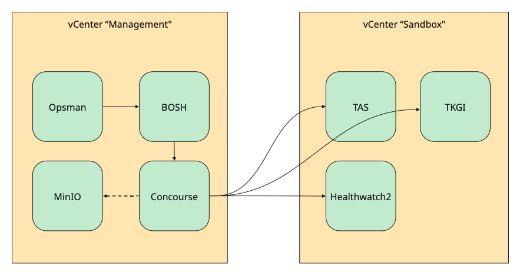

# Automated TAS & TKGI Foundation

In the next series of pages I will explain how to achieve an automated setup of the following target architecture:

This architecture is a common setup our customers have as well:

- a "Management" vCenter that host the Platform Automation Toolkit (Concourse) and all its dependencies. From there we automate all target platforms
- one or more environment-specific vCenters, e.g. a "Sandbox" environment. This vCenter hosts the infrastructure and platform used by the end applications. The entire platform setup should be automated from Management.

I will provision this architecture in my [homelab](../../homelab/index.md) where I will deploy "Management" on my "Management vCenter", which is the vCenter also managing my physical host. The "Sandbox" environment will be a [Nested Lab](../../homelab/index.md#nested-lab-setup). This nested lab includes one nested ESXi host, a vCenter appliance and one NSX Manager.

For automation, Ansible will be used to provision the Platform Automation Toolkit itself and the infrastructure of the Sandbox environment. Concourse will then be used to provision the Platform, i.e. the TAS & TKGI foundation(s).

To begin with, read the next page [Install Concourse for Platform Automation](./install-concourse-for-platform-automation.md).