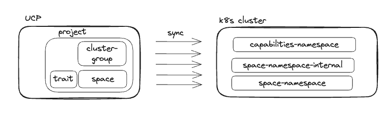

# Tanzu Platform Technical Details

## Goal of this page

The goal of this page is to add additional information around [Tanzu Platform for Kubernetes](https://docs.vmware.com/en/VMware-Tanzu-Platform/services/create-manage-apps-tanzu-platform-k8s/index.html), what you can't easily find in the official documentation, but what you would learn when working hands-on with it. This page tries to go into all necessary technical details required to better understand the concepts. By providing this, it should be easier to manage, own and troubleshoot.

!!! warning
    This page is in progress. Currently it just contains notes, there is no clear format or structure. It's mainly used by myself while studying TP4K8s and I will bring it into a good shape once I understand it better.

## Questions

- how to specify to use `default-istio-gateway` or `spring-cloud-gateway` for ingress

## Concepts

There is a very good page explaining the concepts [here](https://docs.vmware.com/en/VMware-Tanzu-Platform/services/create-manage-apps-tanzu-platform-k8s/concepts-concepts.html). You have to be familiar with

- Spaces
- Capabilities
- Cluster Groups
- Availability Targets
- Profiles
- Traits

## Technical Architecture

The [Platform Engineer Hands-On Lab workshop](https://github.com/Tanzu-Solutions-Engineering/tanzu-platform-workshop/blob/main/lab-platform-engineer/01-full-lab.md#platform-engineer-hands-on-lab) provides a very high-level picture how Tanzu Platform for Kubernetes works technically, described in this picture:



`UCP` stands for *Unified Control Plane* (which you don't find in the official docs as of today). It is technically based on [KCP](https://www.kcp.io/) which essentially gives you a Kubernetes API without having a Kubernetes cluster with all its components like pods, deployments etc. In the end, you can interact with it using `kubectl` and enrich it with custom APIs (CRDs) with only having the APIs in place you wish to have in place.

Let's illustrate that with a simple example without using the Tanzu Platform terminology, but the terminology that we already familiar with when using TKGS or TKGm: Let's say we want to install the [cert-manager Tanzu Package](https://docs.vmware.com/en/VMware-Tanzu-Packages/latest/tanzu-packages/packages-cert-mgr.html) (we will see later that this is called `Capability` in Tanzu Platform terminology) you would install it with

```shell
tanzu package install cert-manager.tanzu.vmware.com -p cert-manager.tanzu.vmware.com -v 1.11.1+vmware.1-tkg.1
```

This will actually not deploy the `PackageInstall` on your target cluster, but on UCP, and UCP will ensure the PackageInstall will be reconciled down to your Kubernetes Cluster.

UCP in Tanzu Platform for Kubernetes is used to reconcile anything that you create via [Hub](https://docs.vmware.com/en/VMware-Tanzu-Platform/SaaS/Using-and-Managing-VMware-Tanzu-Platform-Hub/index.html) (the UI) or via the API (using the tanzu cli) down to your Kubernetes clusters.

### You may ask: what is the motivation behind this approach?

I can think of the following:

TP4K8s has a concept called `Spaces`, which in the end create Kubernetes namespaces in the target K8s clusters. You can specify a space with 3 replicas, which will create 3 K8s namespaces, spread across multiple clusters (that could live in different regions potentially). When you install cert-manager in your space, with this approach of proxying via UCP, UCP will make sure to install cert-manager in all of those 3 namespaces across clusters and also make sure that they are all similarly configured.

In the end, it all drills down to be able to manage a fleet of clusters from a single Control Plane (API), and this is UCP. It allows to bring a fleet of clusters into a consistent and manageable state, heavily using the power of Kubernetes Reconciliation and ensure the desired state is always equal to the actual state.

## Notes

- groupings (cluster groups to group clusters, availability targets to also group clusters, spaces to group namespaces) is all based on labels
- because of label selectors, a cluster might belong to one or many Availability Targets
- because of label selectors, a cluster might belong to one or many Cluster Groups
- capabilities are provided by Tanzu Packages (Carvel Packages) installed to every cluster belonging to the cluster group that provides this capability
- if a capability is *provided* to a cluster group, the corresponding Tanzu Package installed on all clusters in that cluster group have the `capability.tanzu.vmware.com/provides: <capability-name>` annotation
- Capabilities vs Traits
    - Capabilities provides the set of CRDs (with controllers)
    - Traits creates an instance of the CRD (CR - Custom Resource)
    - example:
        - the `cert-manager` capability deploys the `cert-manager` pods and installs the cert-manager CRDs, like `ClusterIssuer`, `Certificate` etc.
        - there is a `multicloud-certmanager` trait, which actually creates certificate issuers, so custom resources of `kind: ClusterIssuer` etc. and actually makes use of the `cert-manager` issuer

- Profiles is just a configuration but you don't really deploy anything by creating a profile. A space is ultimately combining everything to provision something with the information from a profile. This means, that all available capabilities are provided on the cluster group, but you can only use capabilities in your spaces if you have provided them in your space via the profile
- when creating a space you can select an Availability Target and with it how many replicas of the AT - when you configure 3 replicas, the UCP will create 3 managed namespaces across 3 clusters
- namespaces/pods added by Hub (UCP)
    - tanzu-cluster-group-system: used to deploy `PackageInstalls` of all capabilities installed on the cluster group
    - tanzu system
        - `aria-k8s-collector`
        - `syncer`
        - `tanzu-capabilities-controller-manager`
    - vmware-system-tmc
- Hub adds 4 Package Repositories that bundle all capabilities
- when you create a space, it will
    - create a `ManagedNamespaceSet` on UCP
    - which will create a `ManagedNamespace` on UCP
    - which will create two `Namespace`'s on the target cluster, called `<space-name>-<hash>` and `<space-name>-<hash>-internal`
        - the internal namespace is used to deploy `PackageInstalls` of the traits, referenced in the associated profiles
        - the "normal" namespace is used to deploy end applications
- a `Space`and a `ManagedNamespace` (and the final `Namespace` on the target cluster(s) - which is essentially a 1:n mirror from a `ManagedNamespace`) can be compared to a `Deployment` and a `Pod`
    - each time you update the Space, it will create a new `ManagedNamespaceSet`
- `Spaces` are reconciled by a `Space Controller`
- there is a dedicated ManagedNamespace for each AvailabilityTarget of a ManagedNamespaceSet
- once a ManagedNamespace has been created successfully on UCP, there is the `Space Scheduler` that provisions a namespace on a target cluster and installs the traits into that namespace

## FAQ

### UCP stands for Unified Control Plane, correct? Do we explain this on a high-level anywhere in the docs? Or is this not planned to do as the end users don't need to be aware of it?

See [Google Chat](https://chat.google.com/room/AAAA7-TLcC0/iO7H2nRFTMQ/iO7H2nRFTMQ?cls=10).

### Can I interact with UCP using kubectl?

Yes.

1. login with `tanzu login`
1. use a specific context (see below for further information on contexts)
      1. `project` context: `tanzu project use`
      1. `clustergroup` context: `tanzu ops clustergroup use`
      1. `space` context: `tanzu space use`
1. use the kuebconfig at `~/.config/tanzu/kube/config`

A handy thing to do is to create an alias `alias tk="KUBECONFIG=~/.config/tanzu/kube/config kubectl"` and then interact with UCP using `tk` instead of `kubectl`.

### When I have 1 availability target with 3 clusters and I choose to

- deploy a space with 1 replica: will the namespace get deployed on one cluster only? => yes
- deploy a space with 2 replicas: will 2 namespaces get deployed on one cluster or 1 namespace on each cluster? => 2 namespaces on one cluster is possible
- deploy a space with 3 replicas: will the namespace get deployed evenly, 1 namespace on each cluster? => no. 3 namespaces on one cluster is possible
- deploy a space with more replicas than available clusters => explained by above behaviour

### Who are the personas and who is responsible for what?

Where are the boundaries? What's the motivation behind the technical architecture - who is supposed to see what and what is intended to be abstracted away? => https://docs.google.com/document/d/1Rmt-eskKBo2mNDsSdHeVaIWuZU3zhKznEDcRVN9BRRs/edit#heading=h.ixfosuy76boz

### Is there is a dedicated ManagedNamespace for each AvailabilityTarget of a ManagedNamespaceSet

Yes. If you deploy a space to two Availability Targets with one replica each, there is one `ManagedNamespaceSet` on UCP, and two `ManagedNamespace`'s, one for each cluster.

### What happens when I don't enable `Tanzu Application Engine` when creating a cluster Group? Does it mean, the clusters in it are not managed by UCP?

Yes, it doesn't have the `PackageInstall`'s installed in the `tanzu-cluster-group-system` namespace, because you are not able to install capabilities into this clustergroup. Only the `vss-k8s-collector.tanzu.vmware.com` Package will be installed.

### when interacting via kubectl with UCP (using kubeconfig `~/.config/tanzu/kube/config`), then you see different things depending which context you use (`project`, `clustergroup` or `space` context). Which objects do you see using which context?

- `managednamespacesets` - `project` context
- `managednamespaces` - `project` context
- `profiles` - `project` context
- `spaces` - `project` context
- `kubernetesclusters` - `clustergroup` context
- `packagerepositories` - `project` & `clustergroup` contexts, which give you different outputs but not clear what it provides
- `packageinstalls`:
    - `clustergroup` context: you will see all capabilities installed in a clustergroup
    - `space` context: you will see custom PackageInstalls installed in this space
- `availabilitytarget` 
    - `project` context: gives you all Availability Targets of the project
    - `clustergroup` context: gives you only the AVTs that have clusters selected in that cluster group
- `traits` - `project` context, this is because traits are provided out of the box, and at the time of writing it is not possible to create custom traits or capabilities.

### Is it possible to create custom capabilities and traits

No, not at time of this writing.

### When deploying [this sample app](https://github.com/Tanzu-Solutions-Engineering/tanzu-platform-workshop/blob/main/lab-platform-engineer/01-full-lab.md#deploy-a-simple-application-to-the-space-to-smokte-test-our-setup) in the space, it deploys the app itself, the istio gateway pod, a httproute and a gateway. When I have created a space, it already deployed the Spring cloud gateway pod and multicloud-ingress pod. How does ingress to the smoketest app actually work?

Pods that will be deployed when creating a space: `spring-cloud-gateway`, `multicloud-ingress-operator`

Pods that will be deployed when deploying the app: `spring-smoketest`, `default-gateway-istio`

`spring-cloud-gateway` along with a a `kind: SpringCloudGateway` has been deployed because the `spring-cloud-gateway.tanzu.vmware.com` capability has been installed for the cluster group.

The `multicloud-ingress-operator` has been deployed because the `tcs.tanzu.vmware.com` capability, which includes `multicloud-ingress.tanzu.vmware.com` capability, has been installed for the cluster group. It is responsible to spin up the istio gateway pod and the Gateway CR when deploying an app into the space.

Ingress to an application in general goies like this: 

```txt
Internet
    ==> External Load Balancer 
    ==> platform-scoped istio ingress gateway (istio-ingress namespace)
    ==> space-scoped istio ingress gateway
    ==> app
```

When using Spring Cloud Gateway for ingress, it is an additional hop in the ingress chain: internet ==> platform istio ingress gateway ==> space-scoped istio ingress gateway == *via HTTPRoute* ==> SCG ==> app.

When not using Spring Cloud Gateway, the ingress chain is: internet ==> platform istio ingress gateway ==> space-scoped istio ingress gateway == *via HTTPRoute* ==> app.
