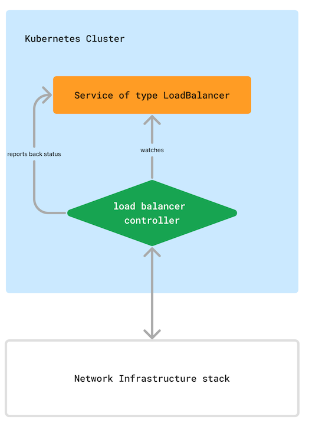

# vSphere with Tanzu integration with NSX-T

This page explains how [Tanzu Kubernetes Clusters](https://docs.vmware.com/en/VMware-vSphere/7.0/vmware-vsphere-with-tanzu/GUID-4D0D375F-C001-4F1D-AAB1-1789C5577A94.html), sometimes referred to as guest clusters or workload clusters, integrate with NSX-T to provide L4 Load Balancing services via [Kubernetes Services of type LoadBalancer](https://kubernetes.io/docs/concepts/services-networking/service/#loadbalancer).

## General concept of Load Balancer integration

A [Kubernetes Service of type LoadBalancer](https://kubernetes.io/docs/concepts/services-networking/service/#loadbalancer) is an upstream Kubernetes concept that assigns a routable external IP address to a Kubernetes Service and, thus, make the service available from outside of the cluster. This IP assignment has to happen by the underlying infrastructure, the underlying network infrastructure to be more specific. Of course Kubernetes does not know and care about the underlying infrastructure, so it is the responsibility of cloud providers and infrastructure providers to implement this functionality.

If you've read [Kubernetes Technical Architecture Concepts](./../kubernetes/technical-architecture-concepts.md) you know that everything in Kubernetes is implemented as controllers. In essence, an infrastructure provider has to implement a load balancer controller and run it on the cluster:

The load balancer controller watches for `Create`, `Update` and `Delete` events of Services of type `LoadBalancer`, interacts with the underlying network infrastructure provider and reports back status.

As an example:

1. a user creates a service of type `LoadBalancer`
1. the load balancer controller reacts on this event and determines it is a `Create` event
1. load balancer controller communicates with the network infrastructure API and creates a Load Balancer, or Virtual Service or similar
1. the network infrastructure API responds with an external IP address
1. the load balancer controller updates the service's `status.loadBalancer` field and especially updates `status.loadBalancer.ingress.ip` with this external IP address.

## Integration in AWS

When you use Amazon Elastic Kubernetes Service (EKS) there is the [AWS Load Balancer Controller](https://kubernetes-sigs.github.io/aws-load-balancer-controller/v2.8/) running on the EKS cluster responsible for provisioning Network Load Balancers and Application Load Balancers.

## Integration in vSphere with Tanzu with NSX-T

The Load Balancer integration on Tanzu Kubernetes Clusters is not as easy and straightforward as explained above. Indeed, there is a NSX-T load balancer controller, the so-called **NSX-T Container Plugin (NCP)**, which you could deploy directly on a Tanzu Kubernetes Cluster. But, vSphere with Tanzu does not deploy it on the guest cluster because it would require to store NSX-T credentials on that cluster, too.

One of the main philosophies in vSphere with Tanzu is having [different personas with different responsibilities](https://docs.vmware.com/en/VMware-vSphere/8.0/vsphere-with-tanzu-concepts-planning/GUID-70CAF0BB-1722-4526-9CE7-D5C92C15D7D0.html): a vSphere administrator, a DevOps engineer (or cluster admin) and an application developer. Tanzu Kubernetes Clusters are purposed for DevOps engineers, sometimes even application developers, giving them full cluster admin permissions on that cluster and consequently empowering full flexibility. The NSX-T infrastructure, though, is maintained by vSphere Administrators, or even another dedicated networking team, but is not maintained by those DevOps engineers or application developers. Therefore, credentials to NSX-T must not be exposed on Tanzu Kubernetes Clusters.

The solution to still be able to integrate with NSX-T and to still be able to dynamically deploy services of type `LoadBalancer` and having the full flexibility as a DevOps engineer working with Kubernetes, vSphere with Tanzu realizes it using the following approach:

Let's see what happens when a user creates a `Service of type LoadBalancer` on a Tanzu Kubernetes Cluster (the same principle applies for `update` and `delete`):

1. on the guest cluster, there is a controller called `guest-cluster-cloud-provider` that watches for Kubernetes Service's `Create`, `Update` and `Delete` events. On the `Create` event it creates a `VirtualMachineService` Custom Resource on the Supervisor cluster by calling the Supervisor Cluster Kubernetes API. This `VirtualMachineService` can have different types, in this example it is of type `LoadBalancer`.
1. On the Supervisor cluster there is a controller called `vmop-controller-manager` that has multiple responsibilities with watching `Create`, `Update` and `Delete` events of the `VirtualMachineService` being one of them. On the `Create` event it creates a Service of type `LoadBalancer` on the Supervisor cluster which is essentially a mirror of the same service deployed on the guest cluster.
1. From this step onwards, the common techniques applies as described above: the `NSX-T Container Plugin (NCP)`, the "NSX-T Load Balancer Controller" running on the Supervisor cluster, watches for Services and interacts with the NSX-T API. In NSX-T, it creates a Load Balancer and a Virtual Service.
1. NSX-T built-in IP address management system assigns an external IP address to this Virtual Service and responds it back to the API Call initiated by NCP.
1. NCP writes the external IP address to the Service's `status.loadBalancer.ingress.ip` on the Supervisor cluster.
1. the `vmop-controller-manager` reacts on this `Update` event and reports back that status to the `VirtualMachineService`.
1. the `guest-cluster-cloud-provider`, which regularly polls the `VirtualMachineService` (it can't subscribe to `Create`, `Update` and `Delete` as it is running on a different Kubernetes Cluster), finally reports back the status, and especially the external IP address, to the original service of type `LoadBalancer` which has been created by the end user.

!!! info
    As you can see in the image, the actual network traffic from the intranet/internet to the target Kubernetes Service running on the Tanzu Kubernetes Cluster goes directly from NSX-T to the target guest cluster, and **not** going the route through the Supervisor Cluster. This "hop" architecture is only used for creating, updating and deleting services.
